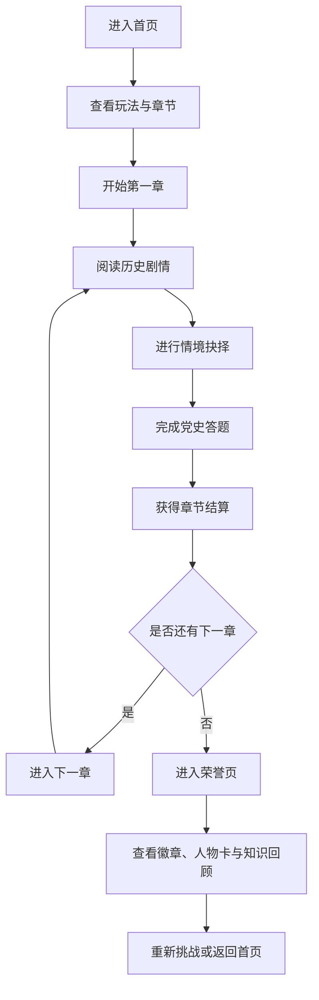

## 1. 产品概述
这是一款以“红色经典叙事 + 党史知识闯关”为核心的网页小游戏，玩家将在经典历史片段中完成抉择、答题与收集任务，逐步点亮党史记忆长卷。
- 主要面向学生、党员学习场景和大众党史普及场景，用更轻量、更有参与感的方式提升党史学习兴趣。
- 产品价值是把传统阅读式学习改造成“剧情体验 + 知识反馈 + 成就激励”的互动传播形式，适合网页快速传播与课堂展示。

## 2. 核心功能

### 2.1 用户角色
本产品为单人体验型网页小游戏，不区分账号角色。

### 2.2 功能模块
1. **首页**：游戏标题、时代氛围视觉、开始游戏、继续章节、荣誉墙入口。
2. **闯关页**：章节剧情、历史抉择、限时答题、进度显示、章节结算。
3. **荣誉页**：已解锁红色人物卡、党史徽章、总分统计、知识回顾。

### 2.3 页面详情
| 页面名称 | 模块名称 | 功能描述 |
|-----------|-----------|-----------|
| 首页 | 主视觉区 | 展示“红色经典长卷”主题标题、背景纹理、开始按钮和学习标语 |
| 首页 | 章节总览 | 展示三大章节：南湖启航、长征抉择、曙光新生，并标明解锁状态 |
| 首页 | 游戏说明 | 介绍玩法规则、得分方式、正确历史价值导向 |
| 闯关页 | 剧情卡片 | 用简短段落还原红色经典场景，突出历史背景与任务目标 |
| 闯关页 | 抉择互动 | 玩家在历史情境中做出选择，选择后立即获得价值判断反馈 |
| 闯关页 | 党史答题 | 每章包含若干道单选题，回答后展示解析并累计分数 |
| 闯关页 | 章节进度 | 展示当前章节、当前题目、生命值/信念值、累计得分 |
| 闯关页 | 章节结算 | 展示章节得分、正确率、解锁人物、历史摘要 |
| 荣誉页 | 人物图鉴 | 展示已解锁人物卡片及其历史贡献简介 |
| 荣誉页 | 徽章系统 | 根据闯关表现解锁“初心如磐”“长征先锋”“薪火传承”等徽章 |
| 荣誉页 | 知识回顾 | 汇总本轮涉及的重点历史节点与答题解析 |

## 3. 核心流程
玩家进入首页后，阅读规则并选择开始游戏；随后依次体验三章党史主题关卡，在剧情中做出价值抉择、完成答题并累计信念值与总分；完成章节后获得人物卡和徽章，最终在荣誉页回顾党史知识并再次挑战高分。

## 4. 用户界面设计
### 4.1 设计风格
- 主色调：朱红、黛黑、旧纸米白、鎏金点缀，营造“红色经典展卷”气质。
- 按钮风格：仿印章感圆角按钮，重要操作带金边高亮与轻微浮雕效果。
- 字体与字号：标题采用有书卷气质的衬线风格，正文使用清晰易读的中文无衬线，突出庄重但不沉闷。
- 布局风格：桌面优先，中心舞台式卡片布局，辅以时间轴和卷轴纹理。
- 图标建议：使用星火、旗帜、徽章、书页、路线等符号，避免娱乐化过度卡通风格。

### 4.2 页面设计概览
| 页面名称 | 模块名称 | UI元素 |
|-----------|-----------|-----------|
| 首页 | 主视觉区 | 红色渐变幕布、纸张纹理、金色标题、缓动出现动画 |
| 首页 | 章节总览 | 三列章节卡、锁定状态、进度标记、悬浮高亮 |
| 闯关页 | 剧情卡片 | 旧报纸边框、段落渐显、章节编号与年份标签 |
| 闯关页 | 抉择区 | 大按钮双选布局、选择后显示历史点评与正确价值导向提示 |
| 闯关页 | 答题区 | 单选题列表、解析展开区、信念值进度条、倒计时或节奏动画 |
| 荣誉页 | 荣誉墙 | 徽章矩阵、人物卡翻牌效果、总成绩数字滚动 |
| 荣誉页 | 知识回顾 | 可滚动时间轴、重点事件节点卡片、再次学习入口 |

### 4.3 响应式
采用桌面优先设计，在移动端收缩为单列布局；按钮与卡片保留足够点击面积，章节卡与答题区支持触屏操作，动画在低性能设备上自动简化。
