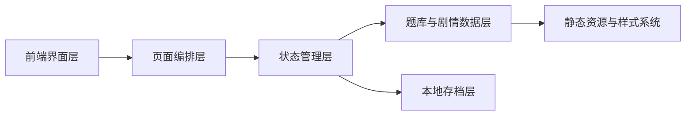
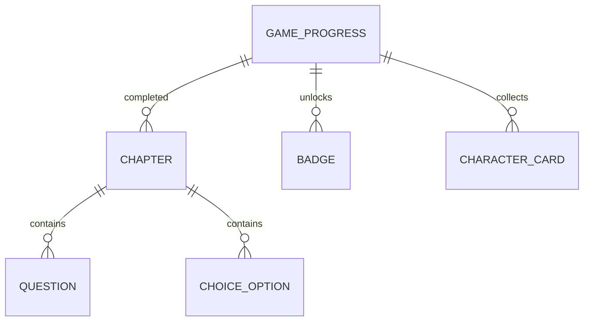

## 1. 架构设计


## 2. 技术描述
- 前端：React@18 + TypeScript + Vite
- 样式：Tailwind CSS + 全局动画样式
- 状态管理：Zustand
- 路由策略：单页应用内的视图切换，不额外引入复杂后端
- 数据持久化：浏览器 `localStorage` 保存章节进度、得分、已解锁荣誉
- 初始化基础：沿用现有 Vite 项目结构，在当前工程内重构页面与状态逻辑

## 3. 路由定义
| 路由 | 用途 |
|-------|------|
| / | 游戏主入口，包含首页、闯关、荣誉三大视图切换 |

## 4. API 定义
本项目为纯前端静态小游戏，不依赖远程接口。核心数据以本地 TypeScript 常量形式维护。

```ts
type GameView = 'home' | 'chapter' | 'honor';

type ChoiceOption = {
  id: string;
  label: string;
  consequence: string;
  beliefDelta: number;
  isCorrect: boolean;
};

type QuizOption = {
  id: string;
  text: string;
};

type QuizQuestion = {
  id: string;
  prompt: string;
  options: QuizOption[];
  answerId: string;
  explanation: string;
};

type ChapterStage = {
  id: string;
  title: string;
  year: string;
  narrative: string;
  choice: {
    prompt: string;
    options: ChoiceOption[];
  };
  quiz: QuizQuestion[];
  unlockCharacter: string;
  summary: string;
};

type GameProgress = {
  currentChapterIndex: number;
  belief: number;
  score: number;
  completedChapterIds: string[];
  unlockedBadges: string[];
  unlockedCharacters: string[];
};
```

## 5. 服务端架构图
本项目无独立服务端。

## 6. 数据模型
### 6.1 数据模型定义


### 6.2 数据定义语言
本项目不使用数据库，采用前端本地数据结构组织内容：
- `chapters`：章节数组，包含年份、剧情、抉择、题目、结算文案。
- `badges`：徽章规则列表，根据分数、正确率、满信念值等条件解锁。
- `characterCards`：人物卡数据，完成章节后逐步解锁。
- `gameProgress`：本地存档对象，记录当前章节、得分、荣誉与历史回顾状态。

## 7. 实现要点
- 以 `App.tsx` 作为主舞台容器，统一管理首页、闯关页、荣誉页切换。
- 抽离 `types`、`data`、`components`，让剧情、题库和 UI 解耦，便于后续扩展更多党史章节。
- 通过章节结算逻辑统一处理得分、信念值恢复、徽章解锁和人物卡解锁。
- 使用渐显、卷轴展开、时间轴推进等动画提升沉浸感，同时确保交互节奏清晰。
- 用 `localStorage` 自动保存进度，支持刷新后继续游戏和一键重新开始。
